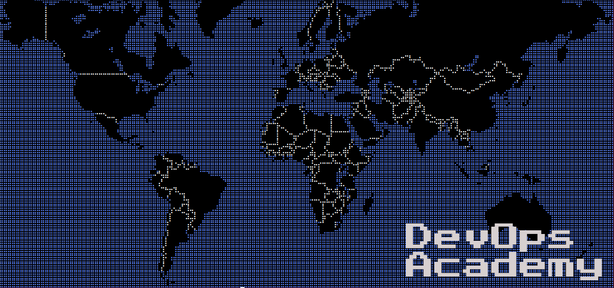

# DevOps Academy 🇨🇱

---

DevOpsAcademy, nace como un proyecto que pretende dar herramientas y habilidades a personas que no han podido subirse al carro del movimiento DevOps/SRE, y que deseen encontrar un trabajo en alguna startup o empresa de ingenieria o tecnologia ya sea nacional o internacional.

---

# Requerimientos 

Para poder iniciar el curso, debes tener un laptop con Linux instalado o un MacBook (lo siento, pero en este momento no soportamos Windows). Los requerimientos minimos para ejecutar las herramientas deberian ser:

- 4GB Memoria RAM o superior (8GB ideal)
- Cualquier CPU Intel/AMD (idealmente Intel i3/i5/i7 con multiples vCPU)
- Espacio disponible en tu disco duro para clonar este repositorio e instalar el software adicional

## Software adicional

Por favor considera los requerimientos minimos para instalar las siguientes aplicaciones:

- [Visual Studio Code](https://code.visualstudio.com/docs/supporting/requirements)
- [Terraform](https://learn.hashicorp.com/terraform/getting-started/install.html)
- Git
- Docker
- Slack
- Enpass/LastPass/1Password (cualquier administrador de contrasenas)

## Servicios adicionales

Por favor crea una cuenta de usuario con los siguientes servicios:

- [Amazon Web Services](https://aws.amazon.com/es/free/)
- [GitHub](https://www.github.com/)

# Contribuidores / Autores

## Victor Vargas 
- [LinkedIn](https://www.linkedin.com/in/victorvargasb/)
- [GitHub](https://github.com/korporationcl)

# Sponsors

- [NovaSapiens](https://www.novasapiens.cl)

# Preguntas Frequentes

## Voy a recibir un diploma o badge lugar de finalizar el curso? 

Respuesta: En este momento no, pero en el futuro una version digital usando un proveedor externo.

## Es este curso para mi? 

Respuesta: Este curso es para ti, **SI** no has tenido ninguna experiencia laboral como "SysAdmin", "System Engineer", "Cloud Engineer", "Cloud Developer" o similar. Si tu eres una persona con experiencia en el campo, este curso no complira tus expectativas.  

## Cuales son las expectativas de este curso?

Respuesta: De nuestra parte es ayudar y proveer desde un punto de vista absolutamente practico, el conocimiento necesario para partir una carrera como DevOps/Cloud Engineer. En conjunto, si tus expectativas son el poder trabajar en una empresa multi-cultural e internacional, te podemos ayudar en temas de reclutamiento e inmersion en el extranjero para mejorar tu nivel de Ingles. 
